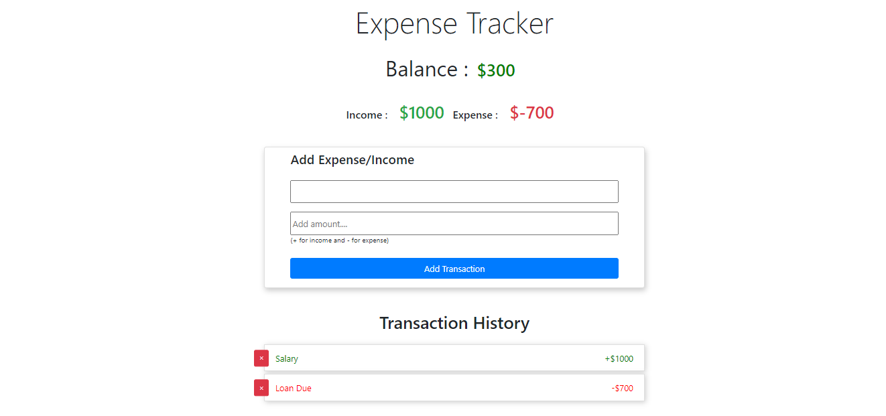

# Expense_Tracker
A Expense Tracker using Pure Vanilla Javascript and Bootstrap for UI

# Features : 

1.Add Expenses.
2.Add Income.
3.Check Balance.
4.Delete the transactions.
5.Datas will be persisted even when page loads as the transactions are stord in localstorage.

# Final Output :

